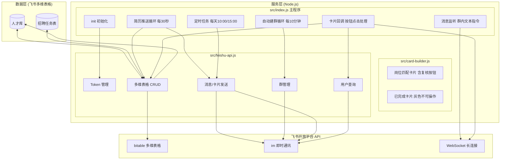
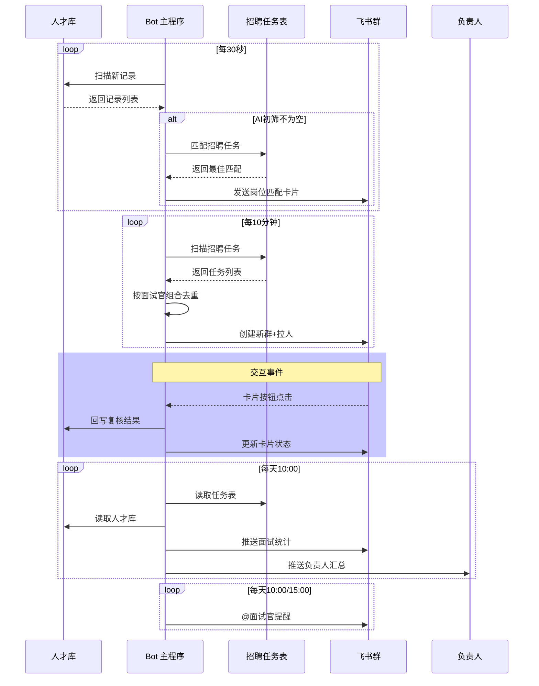

# 飞书招聘机器人

> 自动监控飞书多维表格人才库，实现简历推送、业务复核、面试统计、自动建群、负责人汇总的全流程招聘自动化机器人

## 目录

- [项目概述](#项目概述)
- [完整逻辑与流程](#完整逻辑与流程)
- [核心功能详解](#核心功能详解)
- [架构图](#架构图)
- [数据流向](#数据流向)
- [环境要求](#环境要求)
- [飞书后台配置](#飞书后台配置)
- [快速开始](#快速开始)
- [功能使用手册](#功能使用手册)
- [配置说明](#配置说明)
- [文件结构](#文件结构)
- [常见问题](#常见问题)

---

## 项目概述

这是一个 **Node.js** 项目，通过飞书开放平台 API 操作两个飞书多维表格（人才库 + 招聘任务表），实现招聘流程的全面自动化。

### 涉及的数据源

| 表格 | 链接 | 用途 |
|------|------|------|
| **人才库** | [人才库](https://ywwlaii6ga7.feishu.cn/base/NVh9bDiNRaF0ZysxjeLc5ID2n9c?table=tblWkwsoTIPhzusI&view=vewhPWSFb4) | 存储候选人信息、AI初筛结果、岗位匹配评估、面试评价等 |
| **招聘任务表** | [招聘任务表](https://ywwlaii6ga7.feishu.cn/base/NVh9bDiNRaF0ZysxjeLc5ID2n9c?table=tblEiMBFXcvSspQd&view=vew6FrrDnU) | 招聘任务配置，包含业务一面/HR二面/终面面试官组合、责任人、招聘状态等 |

---

## 完整逻辑与流程

机器人内部运作逻辑如下：

```mermaid
flowchart TD
    A[程序启动: main()] --> B[init 初始化]
    B --> C[获取飞书 Token]
    B --> D[加载招聘任务缓存]
    B --> E[加载选项映射<br>optId->中文名]
    B --> F[标记已有记录]
    B --> G[启动 WebSocket 长连接<br>监听消息和卡片回调]
    G --> H1[定时任务循环]
    G --> H2[消息监听循环]
    G --> H3[卡片回调处理]
    subgraph H1 [定时任务]
        T1[简历推送<br>每30秒] --> T1a[扫描人才库]
        T1a --> T1b{AI初筛不为空?}
        T1b -->|是| T1c[匹配招聘任务]
        T1c --> T1d[找到对应面试官群]
        T1d --> T1e[发送岗位匹配卡片]
        T1e --> T1f[标记已处理]
        T1b -->|否| T1a
        T2[自动建群<br>每10分钟] --> T2a[扫描招聘任务表]
        T2a --> T2b[过滤: 招聘中 + 未处理]
        T2b --> T2c[按面试官组合去重]
        T2c --> T2d[建群+拉人]
        T2d --> T2e[标记已处理]
        T3[面试提醒<br>每天10:00/15:00] --> T3a[扫描招聘中任务]
        T3a --> T3b[找到对应群]
        T3b --> T3c[@业务一面面试官]
        T4[面试统计<br>每天10:00] --> T4a[按面试官组合分组]
        T4a --> T4b[统计: 已推送/面试中/已结束]
        T4b --> T4c[推送到各招聘群]
        T5[负责人汇总<br>每天10:00] --> T5a[按责任人分组]
        T5a --> T5b[统计每个负责人名下群]
        T5b --> T5c[发送到负责人个人飞书]
    end
    subgraph H2 [消息监听]
        M1[群内消息] --> M2{消息内容}
        M2 -->|"面试情况"| M3[触发面试统计]
        M2 -->|"建群"| M4[触发手动建群]
        M2 -->|"姓名 一面评价:内容"| M5[写入一面评价]
    end
    subgraph H3 [卡片回调]
        C1[点击通过按钮] --> C2[写入人才库<br>业务复核=通过]
        C2 --> C3[卡片变灰不可操作]
        D1[点击淘汰按钮] --> D2[写入人才库<br>业务复核=淘汰]
        D2 --> D3[卡片变灰不可操作]
    end
```

---

## 核心功能详解

### 1. 简历自动推送（每 30 秒扫描）

**触发方式**：自动（不可关闭）

**逻辑**：
1. 每 30 秒调用飞书 API 读取人才库视图的所有记录
2. 检查每条记录的 **AI 简历初筛结果** 字段是否为空
3. 如果非空且未处理过该记录：
   - 解析候选人的二级部门、三级部门、招聘岗位、城市
   - 遍历招聘任务表，按评分规则（部门+3，岗位+3，城市+2，招聘中+2）找到最佳匹配任务
   - 根据匹配任务的面试官组合（业务一面、HR二面、终面）找到对应的飞书群
   - 向群内发送 **岗位匹配评估消息卡片**

**卡片内容**：
- 候选人姓名
- 面试岗位 | 招聘岗位
- ✅ 岗位匹配依据（人才库的"岗位能力维度匹配"字段）
- ⚠️ 风险点（人才库的"风险点"字段）
- 业务复核按钮（通过 / 淘汰）
- 时间戳和记录 ID

### 2. 业务复核（卡片按钮回调）

**触发方式**：点击卡片上的"通过"或"淘汰"按钮

**逻辑**：
1. 按钮携带 record_id（人才库记录ID）和 result（pass/reject）
2. **通过** → 写入人才库"业务复核结果"字段为"通过"（选项ID: optAPC5yjs）
3. **淘汰** → 写入人才库"业务复核结果"字段为"淘汰"（选项ID: optJYdXCeR）
4. 更新原卡片为灰色不可操作状态，显示"已通过"或"已淘汰"

### 3. 一面评价

**触发方式**：在群内发送 `姓名 一面评价：内容`

**逻辑**：
1. 正则匹配消息格式，提取候选人姓名和评价内容
2. 在人才库中按姓名查找对应记录
3. 将评价内容写入"一面建议"字段
4. 回复群消息确认

### 4. 面试提醒（每天 10:00 和 15:00）

**触发方式**：自动定时执行

**逻辑**：
1. 每分钟检查当前是否在 10:00 或 15:00
2. 遍历招聘任务缓存，筛选"招聘中"的任务
3. 对每个任务的面试官组合找到对应群（不重复提醒）
4. 在群内 @业务一面面试官 发送面试提醒

### 5. 面试统计（每天 10:00 + 手动"面试情况"）

**逻辑**：
1. 获取人才库全量数据
2. 按招聘任务的面试官组合分组
3. 用部门+岗位+城市匹配人才库候选人
4. 统计：**已推送**（AI初筛不为空）/ **面试中**（业务通过+无评价）/ **面试结束**（业务通过+有评价）
5. 推送到对应招聘群

### 6. 负责人汇总推送（每天 10:00）

**逻辑**：
1. 遍历招聘任务表，按 **责任人** 字段分组
2. 对每个责任人，收集其名下所有招聘任务
3. 按面试官组合分组，统计每个组的数据
4. 汇总成消息发送到责任人个人飞书

### 7. 自动建群（每 10 分钟）

**逻辑**：
1. 每 10 分钟读取招聘任务表
2. 过滤已处理的任务，只处理"招聘中"的任务
3. 提取面试官组合（业务一面/HR二面/终面）去重
4. 对每个唯一组合检查群是否已存在，不存在则创建
5. 群名格式：`面试官1、面试官2招聘群`
6. 自动邀请所有面试官入群

---

## 架构图



---

## 数据流向



---

## 环境要求

这个机器人是 **Node.js** 项目。

| 软件 | 必须吗 | 说明 |
|------|--------|------|
| **Node.js** | 必须 | 运行机器人的基础环境，建议 LTS 版本（v18 以上） |
| **npm** | 必须 | 安装依赖包，装 Node.js 时会自动带上 |
| **Git** | 选装 | 用来更新代码，不装也能用 |
| **Python** | 不用 | 这个项目不需要 Python |

### 检查是否已安装

```cmd
node -v
npm -v
```

显示版本号说明已装好。如果提示"node 不是内部命令"，去 https://nodejs.org 下载 LTS 版安装即可。

---

## 飞书后台配置

### 第 1 步：创建应用

1. 打开 [飞书开发者后台](https://open.feishu.cn/app)
2. 点击 **创建企业自建应用**，填写名称、上传头像

### 第 2 步：获取凭证

左侧菜单 **凭证与基础信息** 页面，找到 **App ID** 和 **App Secret**，复制备用。

### 第 3 步：开启权限

| 权限 | 用途 |
|------|------|
| im:message | 发送消息到群聊和个人 |
| im:chat | 创建群聊、邀请成员、搜索群 |
| bitable:app | 读写多维表格 |
| contact:user.employee_id:readonly | 读取员工信息 |

### 第 4 步：配置事件

订阅方式选择 **长连接**（WebSocket），添加事件：
- card.action.trigger - 处理卡片按钮点击
- im.message.receive_v1 - 接收群内消息

### 第 5 步：设置可用范围

左侧菜单 -> 安全设置 -> 设置可用范围，包含所有需要使用机器人的成员。

### 第 6 步：发布应用

点击右上角 **创建版本** -> **申请发布**，审批通过后生效。

---

## 快速开始

### 1. 克隆代码

```cmd
git clone https://github.com/huangwei-gem/zhaop.git
cd zhaop
```

### 2. 安装依赖

```cmd
npm install
```

### 3. 配置环境变量

在项目根目录创建 .env 文件（或编辑已有的）：

```ini
APP_ID=你的AppID
APP_SECRET=你的AppSecret
INTERVAL=30
BASE_TOKEN=NVh9bDiNRaF0ZysxjeLc5ID2n9c
TALENT_TABLE=tblWkwsoTIPhzusI
TALENT_VIEW=vewhPWSFb4
TASK_TABLE=tblEiMBFXcvSspQd
TASK_VIEW=vew6FrrDnU
```

### 4. 用户授权（建群需要）

首次启动后，机器人会提示需要管理员授权才能创建群聊。
打开浏览器访问授权链接，授权后 user_token.json 自动生成。

### 5. 启动机器人

```cmd
start.bat
```
或
```cmd
npm start
```

启动后看到以下日志即成功：

```
[启动] Token 获取成功
[启动] 已加载 XX 条已有记录
[启动] 初始化完成
[启动] 长连接已启动
```

> 不要关闭这个窗口，关闭即停止机器人

---

## 功能使用手册

### 1. 简历自动推送

什么也不做，机器人自动每 30 秒检查人才库。当有新候选人且 AI 初筛有结果时自动推送卡片到对应面试官群。

### 2. 业务复核

在卡片上点击 **通过**（蓝色）或 **淘汰**（红色）按钮：
- 结果自动回写人才库
- 卡片变为灰色不可操作

### 3. 一面评价

在群内发送：`张三 一面评价：沟通能力强技术基础扎实`
系统自动识别姓名和评价内容，写入人才库。

### 4. 面试提醒

每天 10:00 和 15:00 自动 @面试官。无需手动操作。

### 5. 面试统计

- 自动：每天 10:00 推送到各招聘群
- 手动：群内发送"面试情况"

| 指标 | 含义 |
|------|------|
| 目标招聘人数 | 该组招聘任务的人数总和 |
| 已推送简历 | 人才库AI初筛不为空的记录数 |
| 面试中 | 业务通过 + 无一面评价 |
| 面试结束 | 业务通过 + 已有一面评价 |

### 6. 负责人汇总

每天 10:00 自动按责任人分组推送汇总到个人飞书。
包含责任人名下所有招聘群的进度数据。

### 7. 自动建群

每 10 分钟扫描招聘任务表，自动为新的面试官组合建群：
- 群名格式：`面试官1、面试官2招聘群`
- 自动邀请所有面试官入群
- 已存在的群不重复创建

---

## 配置说明

### 环境变量

| 变量 | 说明 | 默认值 |
|------|------|--------|
| APP_ID | 飞书 App ID（必填） | - |
| APP_SECRET | 飞书 App Secret（必填） | - |
| INTERVAL | 轮询间隔（秒） | 30 |
| BASE_TOKEN | 多维表 app token | NVh9bDiNRaF0ZysxjeLc5ID2n9c |
| TALENT_TABLE | 人才库表 ID | tblWkwsoTIPhzusI |
| TALENT_VIEW | 人才库视图 ID | vewhPWSFb4 |
| TASK_TABLE | 任务表 ID | tblEiMBFXcvSspQd |
| TASK_VIEW | 任务视图 ID | vew6FrrDnU |

### 人才库字段映射

| 代码键 | 多维表字段名 |
|--------|-------------|
| name | 姓名 |
| dept2 | 二级部门 |
| dept3 | 三级部门 |
| pos | 招聘岗位 |
| interviewPos | 面试岗位 |
| loc | 城市 |
| aiResult | AI简历初筛结果 |
| aiMatch | 岗位能力维度匹配 |
| aiRisk | 风险点 |
| bizResult | 业务复核结果 |
| interviewAdvice | 一面建议 |

---

## 匹配逻辑

人才库新增记录时遍历所有招聘任务计算得分：

- 二级部门匹配 +3 分
- 三级部门匹配 +2 分
- 招聘岗位匹配 +3 分
- 工作城市匹配 +2 分
- 状态为招聘中额外 +2 分

选最高分的任务作为匹配结果，得分需大于 0 才视为匹配成功。

---

## 文件结构

```
飞书机器人/
|-- start.bat               # 启动脚本（自动加载 .env）
|-- start_feishu_bot.bat    # 备用启动脚本
|-- package.json            # 项目配置与依赖
|-- README.md               # 本文件
|-- .gitignore              # Git 忽略规则
|-- .env                    # 环境变量（已忽略不提交）
|-- user_token.json         # 用户授权 Token（自动生成已忽略）
|-- src/
    |-- index.js            # 主程序（所有核心逻辑）
    |-- feishu-api.js       # 飞书 API 封装层
    |-- card-builder.js     # 消息卡片构建
```

---

## 常见问题

**Q: Token 获取失败？**
检查 APP_ID 和 APP_SECRET 是否正确，应用是否已发布。

**Q: 建群提示未授权？**
需要管理员授权（首次运行时有提示），授权后 user_token.json 自动生成。

**Q: 卡片按钮没反应？**
检查飞书后台是否已添加 card.action.trigger 事件，订阅方式是否为长连接。

**Q: 负责人收不到汇总？**
检查该负责人是否在飞书应用的"可用范围"内，如不在需添加后重新发布应用。

**Q: 如何停止？**
直接关闭运行中的 CMD 窗口。

**Q: 如何更新代码？**
```cmd
git pull
```
重新启动即可。

---

## License

MIT